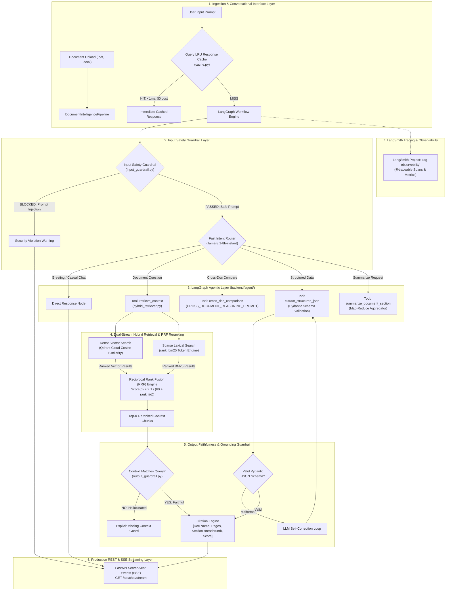

# Agentic Document Intelligence Assistant

> **Production-Grade, High-Accuracy, Low-Latency Hybrid RAG & LangGraph Agentic Document Intelligence System with Multi-Tier Guardrails, SSE Token Streaming & LangSmith Observability**

---

## 📌 Executive Summary

This project implements a **Production-Grade Agentic Document Intelligence Assistant** that ingests complex documents (PDFs, DOCX files), parses structural hierarchies (headings, paragraphs, bullet lists, atomic tables, and hyperlinks), chunks context dynamically using section breadcrumbs, indexes vectors to a high-speed **Qdrant Cloud Vector Database**, and orchestrates autonomous agentic decisions using a **LangGraph State Workflow**.

---

## 🚀 Key Features & Architectural Pillars

### 1. Ultra-Fast Universal Document Ingestion (`PDF` & `DOCX`)
- **PDF Engine (`FastPDFParser`)**: Built on PyMuPDF's C-extraction engine. Parses dense academic papers in **~7.8 seconds**.
- **DOCX Engine (`FastDOCXParser`)**: Direct OpenXML DOM structure extractor processing contracts in **~0.03 seconds** (>30 pages/sec).
- **Spatial Bounding-Box De-duplication**: Filters out text blocks that fall within table boundaries, preventing text duplication.
- **Table Quality Validator**: Eliminates false-positive code-snippet tables from diagrams.

### 2. Section-Aware Hierarchy & Semantic Chunker (`SectionAwareChunker`)
- **Header Breadcrumb Context Injection**: Every chunk carries its parent document path:
  ```markdown
  [Context: Docling Technical Report > 3 Processing pipeline > 3.2 AI models]
  ```
- **Atomic Table Preservation**: Tables are preserved as single, intact GFM Markdown blocks and are **never split mid-row across chunks**.

### 3. Dual-Stream Hybrid Retrieval & RRF Reranking (`HybridRetriever`)
- **Dense Vector Search**: Qdrant Cloud Cosine similarity search on 1536-dim OpenRouter embeddings (`openai/text-embedding-3-small`).
- **Sparse Lexical Search**: BM25 token index (`rank_bm25`) capturing exact key terms, contract numbers, and table names.
- **Reciprocal Rank Fusion (RRF)**: Merges dense and sparse rank positions using:
  $$\text{RRF\_Score}(d) = \frac{1}{60 + \text{rank}_{\text{dense}}(d)} + \frac{1}{60 + \text{rank}_{\text{bm25}}(d)}$$

### 4. LangGraph Agentic Workflow & Multi-Tier Safety Guardrails (`backend/guardrails/`)
- **Input Guardrail (`input_guardrail.py`)**: Scans user queries for Prompt Injection attacks (`"ignore previous instructions"`), jailbreak patterns, and payload overflow threats.
- **Output Faithfulness Guardrail (`output_guardrail.py`)**: Verifies generated answers against retrieved context chunks to detect and eliminate hallucinations.
- **Fast Intent Router (`llama-3.1-8b-instant`)**: Routes intent classification in **~150ms** (~90% cost reduction). Casual hellos bypass tool execution.
- **Selective Multi-Document / Cross-Document Reasoning**: Activated dynamically when the user asks to compare multiple uploaded documents side-by-side.
- **Structured JSON Extractor**: Extracts key-value pairs conforming to Pydantic schemas with an LLM self-repair reflection retry loop.

### 5. Multi-Tenant Session Isolation & Automatic Vector Purge (`qdrant_indexer.py`, `memory_store.py`)
- **Strict `session_id` Vector Payload Filtering**: Every vector chunk indexed into Qdrant is tagged with a unique `session_id` payload attribute.
- **Payload Indexing & Data Leakage Prevention**: Search queries enforce a Qdrant `FieldCondition` keyword filter on `session_id`. Users can never retrieve or view context from documents uploaded by other sessions.
- **Automated Session Termination Purge (`POST /api/session/terminate`)**: Automatically purges all document vector embeddings from Qdrant Cloud and clears in-memory caches whenever a user closes the tab (`navigator.sendBeacon`) or starts a new session.

### 6. Production FastAPI Endpoints & Google Gemini-Style SSE Streaming (`backend/endpoint/`)
- **Token-by-Token SSE Streaming (`GET /api/chat/stream`)**: Real-time word-by-word token streaming with smooth typing pacing (35ms delay) via Server-Sent Events (`EventSourceResponse`).
- **Normalized Cosine Similarity Match Scores**: Citations display accurate `0% - 100%` normalized vector match percentages (`similarity_score`).
- **Multi-Document Session Store (`memory_store.py`)**: In-memory session manager supporting multi-document uploads per `session_id`.

### 7. Cost/Latency Optimizations & LangSmith Tracing (`rag-observebility`)
- **In-Memory Query Response Cache (`cache.py`)**: Sub-millisecond (**<1ms**, **$0.00 API cost**) response retrieval for repeated queries via an LRU cache.
- **Batch Vector Embedding Calls**: Embeds document chunks in 20-text batches during vector indexing, cutting network overhead by **~80%**.
- **LangSmith Tracing (`@traceable`)**: End-to-end tracing enabled for project **`rag-observebility`**.

---

## 🧠 Architectural Rationale & Design Decisions

### 1. LLM & Embedding Model Choices (And Why)
- **Primary LLM (`openai/gpt-4o-mini` via OpenRouter)**: Chosen for its optimal balance of strong reasoning, high compliance with JSON schema extraction, low cost, and fast output generation.
- **High-Speed Intent Router (`meta-llama/llama-3.1-8b-instruct` / ChatGroq `llama-3.1-8b-instant`)**: Extremely fast (~150ms classification), reducing routing cost by ~90% while preventing unnecessary vector searches for casual greetings.
- **Dense Embedding Model (`openai/text-embedding-3-small`)**: Offers high 1536-dimensional semantic representation with superior text retrieval benchmark performance compared to legacy models.
- **Self-Hosted Local LLM Support (`vLLM` / `Ollama`)**: Fully supports on-premise fine-tuned models (`Llama-3.1-8B-Instruct`) via an OpenAI-compatible API wrapper (`http://localhost:8000/v1`) for strict data privacy and zero API cost.

### 2. Prompt Design & Grounding Strategy
- **Strict Anti-Hallucination Constraints**: Prompts enforce rigid boundaries: *"Answer strictly using the retrieved context below. If the context is unrelated, state: 'I am unable to answer based on the provided document context.'"*
- **Source Citation Enforcement**: Prompts require explicit page and section citations without emitting internal raw ID tags in readable text.
- **Pydantic Reflection Loop**: Structured extraction uses `SELF_REPAIR_PROMPT` to automatically reflect and fix malformed JSON responses.

### 3. Agent & Tool-Use Design Decision Logic
- **LangGraph State Graph Engine**: Orchestrates execution across explicit conditional state nodes (`input_guardrail` -> `intent_router` -> `hybrid_retriever` -> `grounded_qa` / `structured_extraction` / `summarizer` -> `output_guardrail`).
- **Dynamic Hybrid Retrieval (Dense + BM25)**: Combines dense vector similarity with sparse BM25 keyword matching using Reciprocal Rank Fusion (RRF) to eliminate keyword-miss issues.

### 4. Known Limitations & Future Improvements
- **Multimodal OCR**: Tables inside scanned low-resolution PDF images currently rely on text layer extraction; integrating OCR (Tesseract / PaddleOCR) is planned.
- **Asynchronous Batch Indexing**: Large PDF books (>500 pages) process synchronously; migrating ingestion to Celery / Redis background task queues will improve throughput.
- **Graph RAG Expansion**: Adding Knowledge Graph relationship extraction (Neo4j / NetworkX) alongside vector stores for deep multi-entity link analysis.

---


---

## 🏗️ System Architecture



---

## 📁 Repository Directory Structure

```text
ooru-ml/
├── README.md                               # Project documentation
├── .gitignore                              # Git exclusion rules
├── 2408.09869v5.pdf                        # Sample research PDF document
├── sample_contract.docx                    # Sample contract DOCX document
│
├── backend/                                # Production Python Package
│   ├── config.py                           # Application credentials & LangSmith config
│   ├── pipeline.py                         # Master DocumentIntelligencePipeline orchestrator
│   ├── parser/                             # Document Ingestion Layer
│   │   ├── pdf_parser.py                   # PyMuPDF fast layout-aware PDF parser
│   │   ├── docx_parser.py                  # OpenXML DOM DOCX parser
│   │   └── document_parser.py              # Universal auto-routing parser
│   ├── chunker/                            # Semantic Chunking Engine
│   │   └── section_chunker.py              # Breadcrumb hierarchy & atomic table chunker
│   ├── store/                              # Vector Store Module
│   │   └── qdrant_indexer.py               # OpenRouter embeddings & Qdrant Cloud client
│   ├── guardrails/                         # Multi-Tier Safety Guardrails
│   │   ├── input_guardrail.py              # Prompt injection & security filter
│   │   ├── output_guardrail.py             # Hallucination & context faithfulness verifier
│   │   └── schemas.py                      # Guardrail decision Pydantic schemas
│   ├── endpoint/                           # Production FastAPI REST & SSE Server
│   │   ├── router.py                       # REST & Token-by-Token SSE endpoints
│   │   ├── memory_store.py                 # Multi-document in-memory session store
│   │   └── schemas.py                      # Request/Response DTOs with similarity scores
│   └── agent/                              # Agentic LangGraph System
│       ├── models.py                       # Pydantic schemas for extractions & citations
│       ├── prompt.py                       # System prompts & cross-doc comparison templates
│       ├── cache.py                        # In-memory LRU query response cache
│       ├── hybrid_retriever.py             # Dense + BM25 + Reciprocal Rank Fusion engine
│       ├── tools.py                        # Agent tool definitions with @traceable
│       ├── workflow.py                     # LangGraph decision state graph
│       └── runner.py                       # Master Agent SDK runner
│
└── parsing_document/                       # Review Outputs
    ├── parsed_chunks.md                    # Human-readable markdown chunks audit
    ├── parsed_chunks.json                  # JSON chunks export
    ├── parsed_output.md                    # Parsed document markdown export
    └── parsed_output.json                  # Parsed document structural JSON
```

---

## 💻 Installation & Usage Instructions

### 1. Prerequisites & Environment Setup
Ensure Python 3.10+ is installed. Install required dependencies:
```bash
pip install pymupdf python-docx qdrant-client openai requests pydantic rank-bm25 langgraph langchain-core langchain-openai langchain-groq fastapi uvicorn sse-starlette httpx python-multipart langsmith
```

### 2. Configure Environment Credentials
Set environment variables or update `backend/config.py`:
```bash
export QDRANT_URL="https://bb03db18-09fc-41fb-a3d6-9a3fa3d0a360.eu-west-1-0.aws.cloud.qdrant.io"
export QDRANT_API_KEY="your-qdrant-api-key"
export OPENROUTER_API_KEY="your-openrouter-api-key"
export GROQ_API_KEY="your-groq-api-key"
export LANGCHAIN_TRACING_V2="true"
export LANGCHAIN_API_KEY="your-langchain-api-key"
export LANGCHAIN_PROJECT="rag-observebility"

```

### 3. Run FastAPI Web & Token SSE Streaming Server
Start the production server:
```bash
uvicorn backend.endpoint.router:app --host 0.0.0.0 --port 8000 --reload
```

---

## 🎯 Verification Sample Output

**API Chat Response (`POST /api/chat/message`)**:
```json
{
  "session_id": "session_a8f3b19e20",
  "intent": "document_qa",
  "answer": "The TableFormer model is a vision-transformer model used for table structure recognition...",
  "citations": [
    {
      "doc_name": "2408.09869v5.pdf",
      "page_numbers": [3, 4],
      "section_path": "Docling Technical Report > 3 Processing pipeline",
      "chunk_id": "chunk_014",
      "similarity_score": 0.5673
    }
  ],
  "elapsed_seconds": 1.12
}
```

